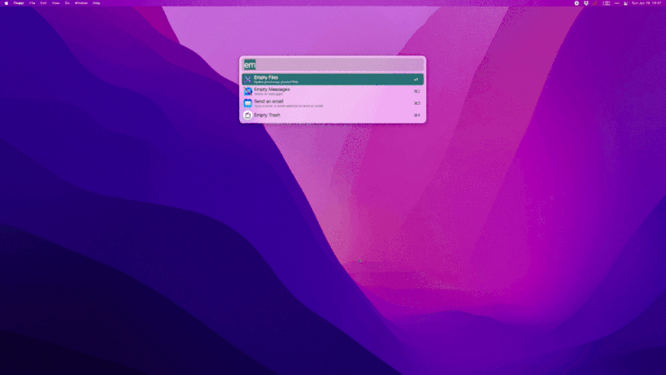

# dash-docset-tcapi


[](https://github.com/alanhg/dash-docset-tcapi/actions/workflows/docset.yml)

腾讯云API文档，云API文档地址：https://cloud.tencent.com/document/api

API例子：https://cloud.tencent.com/document/api/213/15749



## 制作流程

```shell
# 编辑products.txt，添加需要制作的产品，产品码查看腾讯云API文档 https://cloud.tencent.com/document/api

# docset制作
./build.js --create=true

```

## Dash中订阅文档🔔

已接入CI，每周自动更新。浏览器地址栏输入以下地址回车。

```
dash-feed://https%3A%2F%2Fraw.githubusercontent.com%2Falanhg%2Fdash-docset-tcapi%2Fmain%2Ffeed.xml
```

## 说明

文档全量数据太多，推荐按需爬取，如需个性化抓取，fork repo手动修改products.txt。

目前抓取以下几个产品文档

1. 云服务器：https://cloud.tencent.com/document/api/213
2. 访问管理：https://cloud.tencent.com/document/api/598
3. 轻量云服务器： https://cloud.tencent.com/document/api/1207
4. 自动化助手：https://cloud.tencent.com/document/api/1340
5. 私有网络：https://cloud.tencent.com/document/api/215

